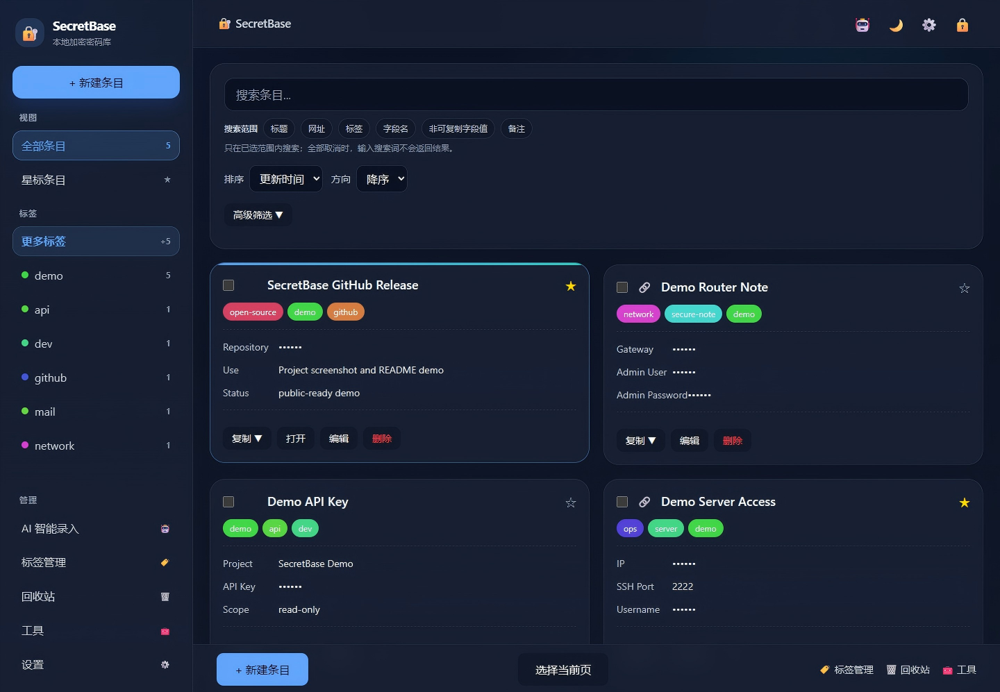
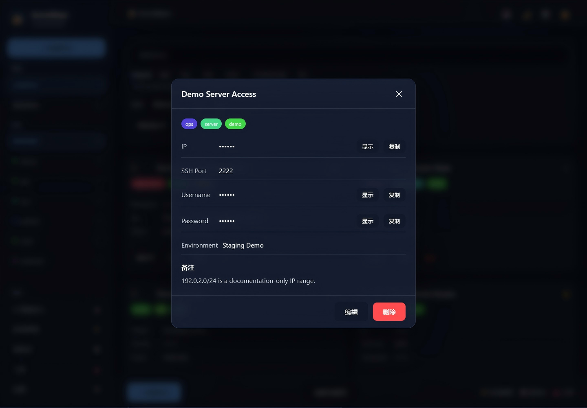
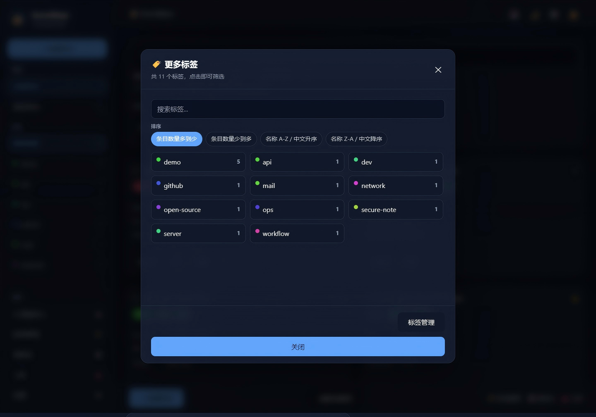
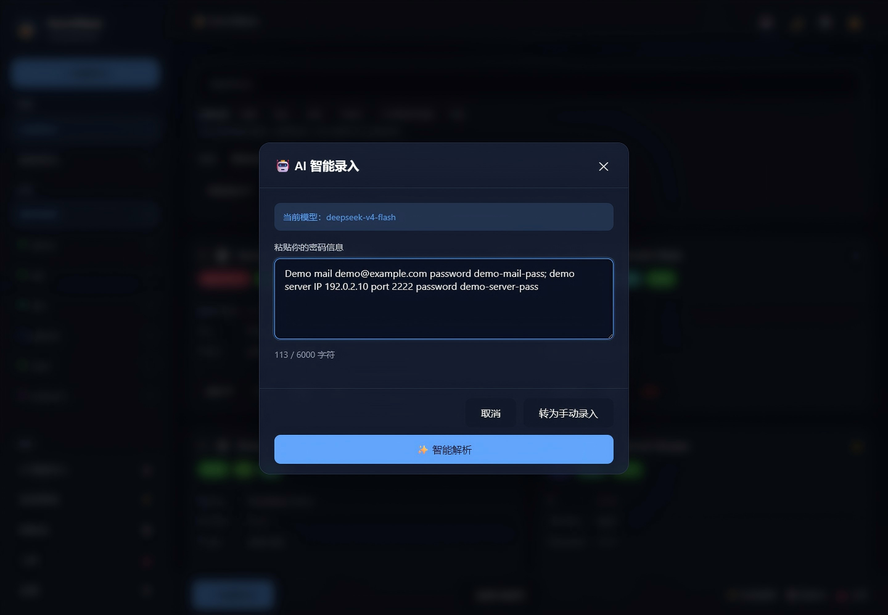
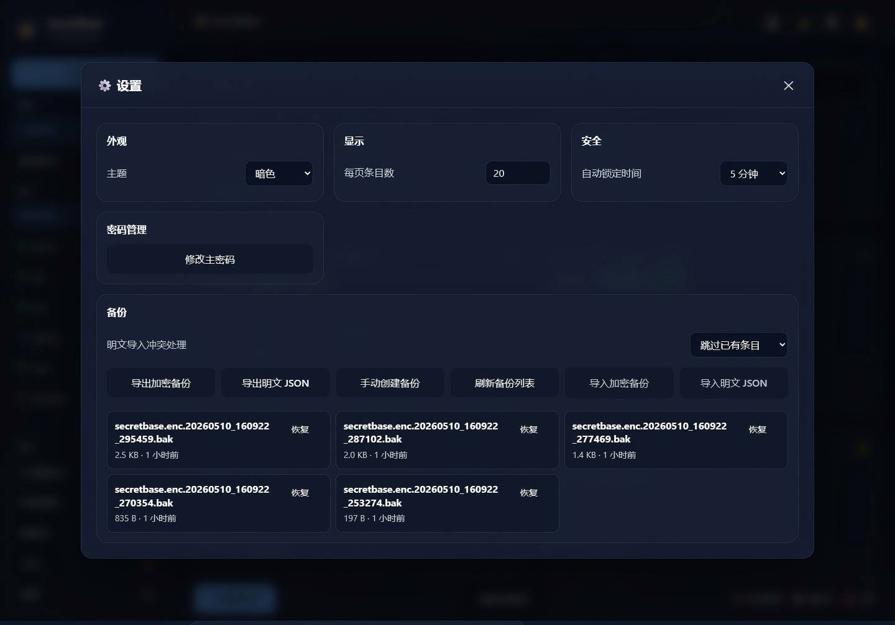
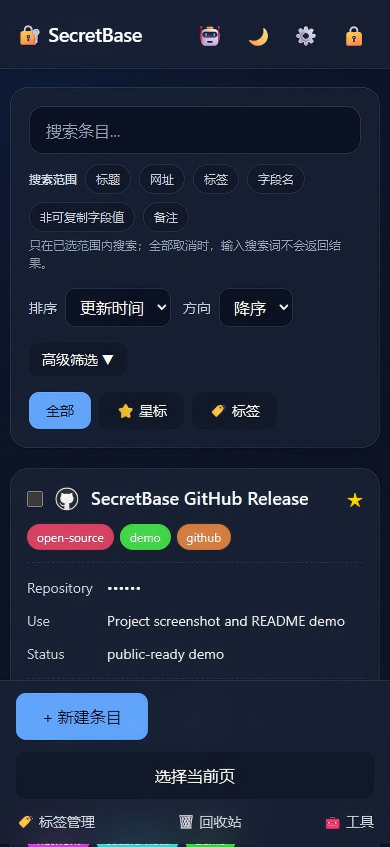

<p align="center">
  <strong>SecretBase</strong>
</p>

<p align="center">
  Self-hosted single-user encrypted password vault.<br>
  自托管单用户加密密码库。
</p>

<p align="center">
  <a href="#screenshots--界面预览">Screenshots</a> · <a href="#中文">中文</a> · <a href="#english">English</a> · <a href="docs/security-design.md">Security Design</a> · <a href="docs/deployment.md">Deployment</a>
</p>

<p align="center">
  
  
  
  
  
</p>

---

## Screenshots / 界面预览

The screenshots below use demo-only data. They do not contain real credentials, real servers, or private deployment details.

以下截图均使用演示数据，不包含真实密码、真实服务器或私人部署信息。

<table>
  <tr>
    <td width="50%">
      <strong>Desktop Overview / 桌面总览</strong><br>
      
    </td>
    <td width="50%">
      <strong>Entry Detail / 条目详情</strong><br>
      
    </td>
  </tr>
  <tr>
    <td width="50%">
      <strong>Tag Browser / 标签浏览</strong><br>
      
    </td>
    <td width="50%">
      <strong>AI Parsing / AI 智能录入</strong><br>
      
    </td>
  </tr>
  <tr>
    <td width="50%">
      <strong>Backup Settings / 备份设置</strong><br>
      
    </td>
    <td width="50%">
      <strong>Mobile Layout / 移动端布局</strong><br>
      
    </td>
  </tr>
</table>

## 中文

SecretBase 是一个面向个人自托管场景的单用户加密密码库。项目采用 FastAPI 后端和 Vue 3 CDN 前端，不依赖数据库或前端构建链，数据以加密 vault 文件形式保存在本地文件系统中。

项目目标是提供一个结构清晰、易于审计、易于备份恢复的密码管理工具，适用于个人服务器、本地局域网或受访问控制保护的私有部署环境。

### 目录

- [项目定位](#项目定位)
- [系统架构](#系统架构)
- [功能概览](#功能概览)
- [安全模型](#安全模型)
- [部署安全要求](#部署安全要求)
- [本地开发](#本地开发)
- [配置项](#配置项)
- [AI 解析](#ai-解析)
- [验证命令](#验证命令)
- [生产部署概览](#生产部署概览)
- [项目结构](#项目结构)
- [文档](#文档)

### 项目定位

| 分类 | 说明 |
| --- | --- |
| 使用模型 | 单用户、单 vault、无注册系统。 |
| 数据存储 | 本地加密文件存储，无数据库依赖。 |
| 前端形态 | Vue 3 CDN、原生 JavaScript、原生 CSS。 |
| 后端形态 | FastAPI 提供认证、条目、标签、导入导出、工具报告和 AI 解析接口。 |
| 部署方式 | 推荐部署在反向代理、HTTPS 和额外访问控制之后。 |
| 适用场景 | 个人密码管理、服务器凭据管理、API Key 管理、安全笔记和恢复码存档。 |

### 非目标

| 范围外能力 | 说明 |
| --- | --- |
| 多用户协作 | 当前版本不实现组织、团队、共享 vault 或多租户权限模型。 |
| 云同步 | 项目不默认上传、同步或托管用户 vault。 |
| 企业 KMS | 不替代 HSM、KMS、SSO、合规审计或集中化密钥管理系统。 |
| 浏览器插件 | 当前仓库只提供 Web UI 和后端服务。 |

### 系统架构

```text
Browser
  Vue 3 CDN + JavaScript + CSS
        |
        | X-SecretBase-Token
        v
FastAPI backend on 127.0.0.1:10004
        |
        | PBKDF2-HMAC-SHA256 + AES-256-GCM
        v
Encrypted vault file
  backend/data/secretbase.enc
```

### 功能概览

| 模块 | 功能 |
| --- | --- |
| 认证 | 主密码初始化、解锁、锁定、自动锁定、随机 session token。 |
| 条目管理 | 标题、网址、自定义字段、可复制字段、备注、星标、标签。 |
| 搜索与筛选 | 标题、网址、标签、字段名、非敏感字段值、备注、高级筛选、排序和分页。 |
| 字段保护 | 列表接口默认掩码可复制字段，详情接口按需返回明文。 |
| 标签管理 | 标签列表、重命名、删除、合并、按数量和名称排序。 |
| 回收站 | 软删除、恢复、永久删除、清空回收站。 |
| 批量操作 | 批量删除、批量星标、批量更新标签。 |
| 导入导出 | 加密备份导出、明文 JSON 导出、导入预览、恢复、旧备份兼容。 |
| 工具报告 | 密码健康检查、维护报告、安全配置检查。 |
| AI 辅助 | 可选的自然语言解析，将文本转换为结构化条目。 |

### 安全模型

SecretBase 的核心安全边界是本地加密 vault 文件。vault 只有在提供主密码并成功解锁后才会被读取为明文数据。后端在解锁期间维护派生密钥、vault 数据和 session token；锁定、自动锁定或服务重启后，解锁态失效。

| 机制 | 设计 |
| --- | --- |
| 主密码 | 不保存明文主密码。 |
| 密钥派生 | PBKDF2-HMAC-SHA256。 |
| 加密算法 | AES-256-GCM。 |
| Vault 文件 | 默认 `backend/data/secretbase.enc`，必须排除在 Git 之外。 |
| 会话认证 | 解锁后生成随机 token，受保护 API 使用 `X-SecretBase-Token`。 |
| 自动锁定 | 根据空闲时间清理解锁态。 |
| 并发保护 | 文件锁、乐观锁、原子写入和写入前备份。 |
| 日志脱敏 | 对密码、token、API key、authorization 等敏感字段脱敏。 |

完整安全设计见 `docs/security-design.md`。

### 部署安全要求

- 生产环境后端应绑定到 `127.0.0.1`，避免直接暴露到公网。
- 推荐通过 nginx 或其他反向代理统一提供 HTTPS 入口。
- 公网部署应增加 Basic Auth、VPN 或 zero-trust 网关等外层访问控制。
- 生产环境不得使用 `CORS_ORIGINS=*`。
- 不得提交 `backend/.env`、`backend/data/`、`backend/logs/`、`backend/settings.json`、vault 文件或备份文件。
- 主密码不可恢复，部署方应建立独立的主密码保管和恢复策略。
- 备份应定期创建，并通过恢复演练验证可用性。

### 本地开发

后端：

```powershell
cd backend
python -m venv .venv
.\.venv\Scripts\Activate.ps1
pip install -r requirements.txt
copy .env.example .env
python main.py
```

前端：

```powershell
python -m http.server 8001 -d frontend
```

访问地址：

```text
http://127.0.0.1:8001
```

### 配置项

复制 `backend/.env.example` 到 `backend/.env` 后按部署环境调整。

```env
HOST=127.0.0.1
PORT=10004
VAULT_PATH=./data/secretbase.enc
BACKUP_DIR=./data/backups/
CORS_ORIGINS=https://your-domain.example
DEEPSEEK_API_KEY=
AI_API_URL=https://api.deepseek.com/chat/completions
AI_MODEL=deepseek-v4-flash
```

| 变量 | 说明 |
| --- | --- |
| `HOST` | 后端监听地址，生产建议使用 `127.0.0.1`。 |
| `PORT` | 后端端口，默认 `10004`。 |
| `VAULT_PATH` | 加密 vault 文件路径。 |
| `BACKUP_DIR` | 自动备份目录。 |
| `CORS_ORIGINS` | 允许访问 API 的前端来源。 |
| `DEEPSEEK_API_KEY` | 可选，留空时禁用 AI 解析。 |
| `AI_API_URL` | DeepSeek 兼容 chat completions 接口。 |
| `AI_MODEL` | AI 解析使用的模型名。 |

### AI 解析

AI 解析是可选功能。未配置 API key 时，核心密码管理、搜索、备份和恢复功能不受影响。

示例输入：

```text
示例邮箱 demo@example.com 密码 demo-mail-pass；示例服务器 IP 192.0.2.10 端口 2222 密码 demo-server-pass
```

后端会要求模型返回结构化 JSON，并对常见响应格式差异执行归一化处理。AI 解析结果仍应由用户确认后再保存。

### 验证命令

```powershell
python -m compileall backend
$env:DEEPSEEK_API_KEY=''; $env:AI_API_KEY=''; python scripts\v1-fake-smoke-test.py
node --check frontend\js\app.js
node --check frontend\js\api.js
node --check frontend\js\store.js
node --check frontend\js\utils.js
```

`scripts/v1-fake-smoke-test.py` 使用临时 vault，不会读取或修改真实数据。

### 生产部署概览

推荐部署拓扑：

```text
Internet
   |
HTTPS reverse proxy
   |
External access control
  Basic Auth / VPN / zero-trust gateway
   |
Static frontend + /api proxy
   |
FastAPI backend on 127.0.0.1
   |
Encrypted vault + backups
```

辅助脚本：

| 脚本 | 用途 |
| --- | --- |
| `scripts/install.sh` | 通用 Linux 安装脚本。 |
| `scripts/backup.sh` | 备份加密 vault 和配置文件。 |
| `scripts/restore.sh` | 从备份恢复 vault。 |
| `scripts/healthcheck.sh` | 检查服务状态和健康接口。 |
| `scripts/dev-backend.ps1` | Windows 本地后端启动脚本。 |
| `scripts/dev-frontend.ps1` | Windows 本地前端启动脚本。 |

详细部署说明见 `docs/deployment.md`。

### 项目结构

```text
backend/
  main.py              FastAPI app, middleware, authentication gate
  config.py            environment and path configuration
  crypto.py            vault encryption and key derivation
  storage.py           vault state, locking, persistence, backups
  routes/              auth, entries, tags, trash, transfer, tools, AI
frontend/
  index.html           Vue CDN application shell
  js/                  API client, app logic, store, utilities
  css/                 layout, components, themes
docs/
  api-specification.md
  deployment.md
  frontend-design.md
  release-safety-checklist.md
  roadmap.md
  security-design.md
scripts/
  local development, smoke test, deployment and maintenance helpers
```

### 文档

- `docs/api-specification.md`：API 契约和响应格式。
- `docs/security-design.md`：加密、密钥管理、vault、日志和部署安全设计。
- `docs/frontend-design.md`：前端结构、状态管理和交互说明。
- `docs/deployment.md`：通用生产部署步骤。
- `docs/release-safety-checklist.md`：发布前安全检查清单。
- `docs/roadmap.md`：路线图。

### License

MIT License. See `LICENSE`.

---

## English

SecretBase is a self-hosted, single-user encrypted password vault. It uses a FastAPI backend and a Vue 3 CDN frontend, does not require a database or frontend build chain, and stores vault data as an encrypted file on the local filesystem.

The project is intended to provide a clear, auditable, and backup-friendly password management tool for personal servers, local networks, and private deployments protected by external access controls.

### Contents

- [Positioning](#positioning)
- [Architecture](#architecture)
- [Feature Overview](#feature-overview)
- [Security Model](#security-model)
- [Deployment Security Requirements](#deployment-security-requirements)
- [Local Development](#local-development)
- [Configuration](#configuration)
- [AI Parsing](#ai-parsing)
- [Verification](#verification)
- [Production Deployment Overview](#production-deployment-overview)
- [Repository Layout](#repository-layout)
- [Documentation](#documentation)

### Positioning

| Category | Description |
| --- | --- |
| Usage model | Single user, single vault, no registration system. |
| Storage | Local encrypted file storage, no database dependency. |
| Frontend | Vue 3 CDN, plain JavaScript, plain CSS. |
| Backend | FastAPI APIs for authentication, entries, tags, transfer, reporting, and AI parsing. |
| Deployment | Recommended behind a reverse proxy, HTTPS, and external access control. |
| Use cases | Personal password management, server credentials, API keys, secure notes, and recovery codes. |

### Non-goals

| Out of scope | Description |
| --- | --- |
| Multi-user collaboration | No organizations, teams, shared vaults, or multi-tenant permission model. |
| Cloud sync | SecretBase does not upload, synchronize, or host user vaults by default. |
| Enterprise KMS | It does not replace HSM, KMS, SSO, compliance audit, or centralized key management systems. |
| Browser extension | This repository provides a Web UI and backend service only. |

### Architecture

```text
Browser
  Vue 3 CDN + JavaScript + CSS
        |
        | X-SecretBase-Token
        v
FastAPI backend on 127.0.0.1:10004
        |
        | PBKDF2-HMAC-SHA256 + AES-256-GCM
        v
Encrypted vault file
  backend/data/secretbase.enc
```

### Feature Overview

| Module | Capabilities |
| --- | --- |
| Authentication | Master-password initialization, unlock, lock, auto-lock, random session token. |
| Entries | Title, URL, custom fields, copyable fields, notes, stars, and tags. |
| Search and filters | Title, URL, tags, field names, non-sensitive field values, notes, advanced filters, sorting, and pagination. |
| Field protection | Copyable fields are masked in list responses and returned in plaintext only by detail APIs. |
| Tags | List, rename, delete, merge, and sort by count or name. |
| Trash | Soft delete, restore, permanent delete, and empty trash. |
| Batch operations | Batch delete, batch star, and batch tag updates. |
| Import and export | Encrypted backup export, plain JSON export, import preview, restore, and legacy backup compatibility. |
| Reports | Password health report, maintenance report, and security configuration report. |
| AI assistance | Optional natural-language parsing into structured entries. |

### Security Model

The primary security boundary is the local encrypted vault file. The vault is decrypted only after a valid master password is provided. While unlocked, the backend process maintains the derived key, vault data, and session token in memory. Locking, auto-locking, or restarting the service invalidates the unlocked state.

| Mechanism | Design |
| --- | --- |
| Master password | Plaintext master password is not stored. |
| Key derivation | PBKDF2-HMAC-SHA256. |
| Encryption | AES-256-GCM. |
| Vault file | Default path is `backend/data/secretbase.enc`; it must be excluded from Git. |
| Session authentication | Unlock creates a random token; protected APIs use `X-SecretBase-Token`. |
| Auto-lock | Idle timeout clears the unlocked state. |
| Concurrency protection | File locking, optimistic locking, atomic writes, and pre-write backups. |
| Log redaction | Sensitive fields such as passwords, tokens, API keys, and authorization headers are redacted. |

See `docs/security-design.md` for the full design.

### Deployment Security Requirements

- Bind the backend to `127.0.0.1` in production and avoid direct public exposure.
- Serve public traffic through nginx or another HTTPS reverse proxy.
- Add Basic Auth, VPN, or a zero-trust gateway for external access.
- Do not use `CORS_ORIGINS=*` in production.
- Never commit `backend/.env`, `backend/data/`, `backend/logs/`, `backend/settings.json`, vault files, or backup files.
- The master password is not recoverable; operators should maintain an independent password custody process.
- Backups should be created regularly and validated with restore drills.

### Local Development

Backend:

```powershell
cd backend
python -m venv .venv
.\.venv\Scripts\Activate.ps1
pip install -r requirements.txt
copy .env.example .env
python main.py
```

Frontend:

```powershell
python -m http.server 8001 -d frontend
```

Open:

```text
http://127.0.0.1:8001
```

### Configuration

Copy `backend/.env.example` to `backend/.env` and adjust it for the target environment.

```env
HOST=127.0.0.1
PORT=10004
VAULT_PATH=./data/secretbase.enc
BACKUP_DIR=./data/backups/
CORS_ORIGINS=https://your-domain.example
DEEPSEEK_API_KEY=
AI_API_URL=https://api.deepseek.com/chat/completions
AI_MODEL=deepseek-v4-flash
```

| Variable | Description |
| --- | --- |
| `HOST` | Backend bind address. Use `127.0.0.1` in production. |
| `PORT` | Backend port. Default is `10004`. |
| `VAULT_PATH` | Encrypted vault file path. |
| `BACKUP_DIR` | Automatic backup directory. |
| `CORS_ORIGINS` | Allowed frontend origins for API access. |
| `DEEPSEEK_API_KEY` | Optional. Leave empty to disable AI parsing. |
| `AI_API_URL` | DeepSeek-compatible chat completions endpoint. |
| `AI_MODEL` | Model name used for AI parsing. |

### AI Parsing

AI parsing is optional. If no API key is configured, core password management, search, backup, and restore workflows remain available.

Example input:

```text
Demo mail demo@example.com password demo-mail-pass; demo server IP 192.0.2.10 port 2222 password demo-server-pass
```

The backend requests structured JSON from the model and normalizes common response-format variations. AI-generated entries should be reviewed before they are saved.

### Verification

```powershell
python -m compileall backend
$env:DEEPSEEK_API_KEY=''; $env:AI_API_KEY=''; python scripts\v1-fake-smoke-test.py
node --check frontend\js\app.js
node --check frontend\js\api.js
node --check frontend\js\store.js
node --check frontend\js\utils.js
```

`scripts/v1-fake-smoke-test.py` uses a temporary vault and does not read or modify real data.

### Production Deployment Overview

Recommended topology:

```text
Internet
   |
HTTPS reverse proxy
   |
External access control
  Basic Auth / VPN / zero-trust gateway
   |
Static frontend + /api proxy
   |
FastAPI backend on 127.0.0.1
   |
Encrypted vault + backups
```

Helper scripts:

| Script | Purpose |
| --- | --- |
| `scripts/install.sh` | Generic Linux installation helper. |
| `scripts/backup.sh` | Back up encrypted vault and configuration files. |
| `scripts/restore.sh` | Restore vault from backup. |
| `scripts/healthcheck.sh` | Check service status and health endpoint. |
| `scripts/dev-backend.ps1` | Windows local backend starter. |
| `scripts/dev-frontend.ps1` | Windows local frontend starter. |

See `docs/deployment.md` for detailed deployment instructions.

### Repository Layout

```text
backend/
  main.py              FastAPI app, middleware, authentication gate
  config.py            environment and path configuration
  crypto.py            vault encryption and key derivation
  storage.py           vault state, locking, persistence, backups
  routes/              auth, entries, tags, trash, transfer, tools, AI
frontend/
  index.html           Vue CDN application shell
  js/                  API client, app logic, store, utilities
  css/                 layout, components, themes
docs/
  api-specification.md
  deployment.md
  frontend-design.md
  release-safety-checklist.md
  roadmap.md
  security-design.md
scripts/
  local development, smoke test, deployment and maintenance helpers
```

### Documentation

- `docs/api-specification.md`: API contract and response shapes.
- `docs/security-design.md`: encryption, key management, vault, logging, and deployment security.
- `docs/frontend-design.md`: frontend structure, state management, and UX notes.
- `docs/deployment.md`: generic production deployment steps.
- `docs/release-safety-checklist.md`: release safety checklist.
- `docs/roadmap.md`: roadmap.

### License

MIT License. See `LICENSE`.
